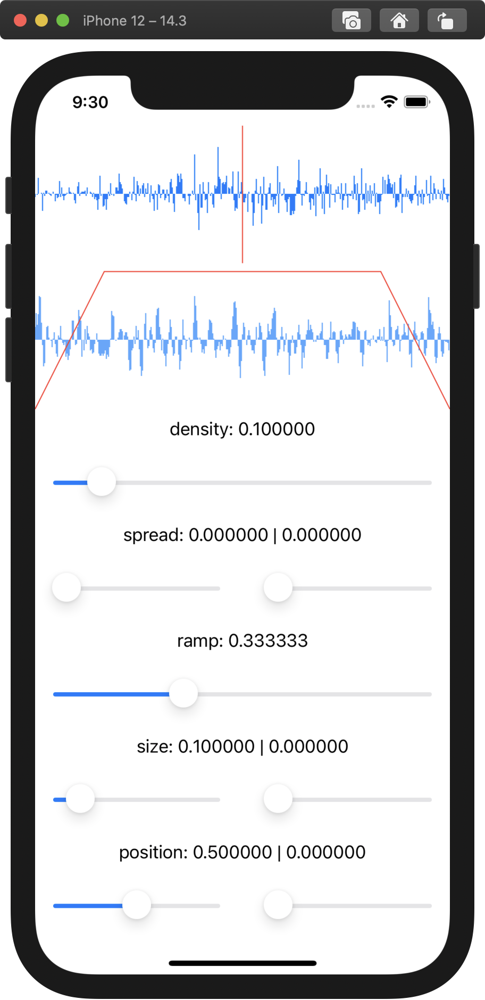

# GrainSwift

Open source granular synthesizer for iOS, written in Swift using SwiftUI.

## Where we are

## How we got here

1. [Part 1](http://the.strange.agency/blog/open-grain-01/)
1. [Part 2](http://the.strange.agency/blog/open-grain-02/)
1. [Part 3](http://the.strange.agency/blog/open-grain-03/)
1. [Part 4](http://the.strange.agency/blog/open-grain-04/)
1. [Part 5](http://the.strange.agency/blog/open-grain-05/)

